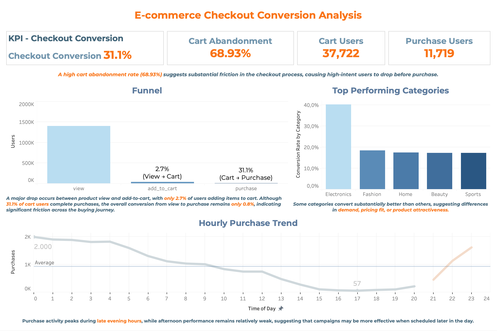

# 📊 E-commerce Checkout Conversion Analysis

This project analyzes user behavior in a Shopee-style e-commerce platform using event-level data to identify key drop-off points in the purchase funnel and uncover opportunities to improve conversion.

---

## 🎯 Objective

- Identify where users drop off in the funnel (**View → Cart → Purchase**)  
- Measure checkout performance and cart abandonment  
- Generate data-driven insights to improve conversion  

---

## 📦 Dataset

- **Source:** RetailRocket E-commerce Dataset (Kaggle)  
- **Type:** Event-level clickstream data  

**Events:**
- `view` – product view  
- `addtocart` – add to cart  
- `transaction` – purchase  

---

## 🛠 Tools

- MySQL (data processing & analysis)  
- SQL (funnel & aggregation queries)  
- Tableau (dashboard visualization)  

---

## 📈 Key Metrics

- View → Cart Rate  
- Cart → Purchase Rate  
- Cart Abandonment Rate  
- End-to-End Conversion Rate  

---

## 📊 Dashboard



---

## 🔍 Key Findings

- **Severe drop at View → Cart (2.7%)**  
  Most users browse but do not add products to cart → weak product engagement  

- **Checkout conversion: 31.1%**  
  Indicates moderate friction in the checkout process  

- **High cart abandonment: 68.93%**  
  Significant loss of high-intent users before purchase  

- **Category performance gap**  
  Electronics (~40%) significantly outperforms other categories (~17–18%)  

- **Time-based behavior**  
  Purchases peak during late evening hours  

---

## 🧠 Key Insight

The biggest bottleneck is not only in checkout.

👉 The most critical drop happens earlier:  
**View → Add to Cart**

This suggests that improving product engagement is as important as optimizing checkout.

---

## 💡 Recommendations

- Improve product pages (images, pricing clarity, reviews)  
- Simplify checkout flow  
- Reduce hidden costs (shipping, taxes)  
- Add retry/payment fallback mechanisms  
- Optimize campaigns during peak hours  

---

## 📈 Estimated Impact

- Increase View → Cart: **2.7% → ~4.0%**  
- Reduce abandonment: **68.9% → ~55–60%**  
- Improve overall conversion: **~0.8% → ~1.0–1.1%**  

---

## 📂 Project Structure

```text
ecommerce-checkout-conversion-analysis/
│
├── sql/
│   ├── data_cleaning.sql
│   ├── funnel_analysis.sql
│   ├── abandoned_cart.sql
│   ├── category_analysis.sql
│   └── time_analysis.sql
│
└── dashboard/
    └── Dashboard.png
